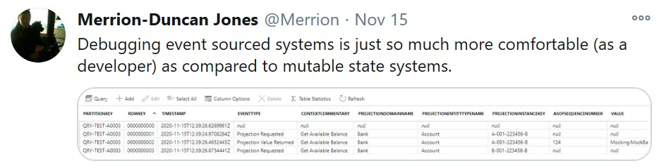
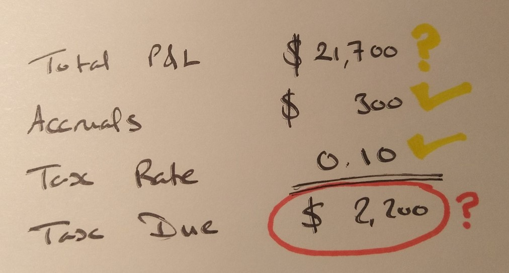
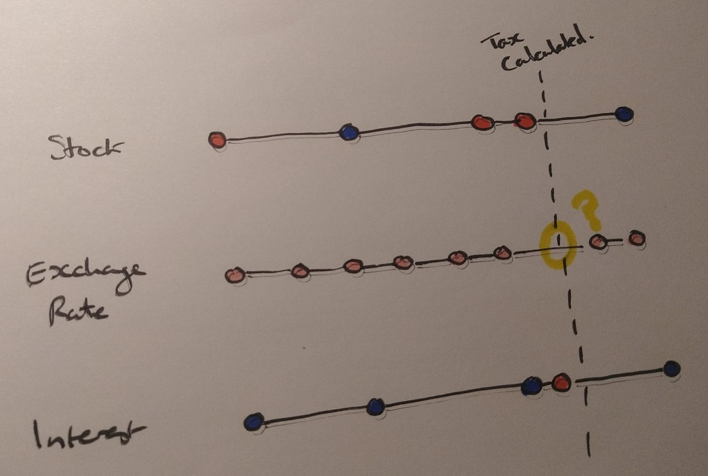

# How Event Sourcing makes for a better debugging experience for developers

## It started with a tweet....

I wrote this tweet last weekend after I had been doing some investigating of a sporadic defect in a piece of software I have been working on for a few years: 

It got quite a reaction so I thought I would expand on it to explain the how and the why of this statement.

## Time, the great disruptor

The first thing I tend to try when I encounter a production bug is educated guesswork. I think out a "well, it is probably because of _x_" narrative and put in a fix to compensate for that. This almost never works.

Once I have passed the stage of educated guesswork, the next process in diagnostic debugging of a production issue involves attempting to recreate the state as at which the defect manifested itself, and then stepping through the code from that state so as to _catch the bug in the act_ as it happened.  This is both difficult and time consuming. It requires finding out when the cause occurred, what the source code was at the time and what the state of all the entities or records involved in the issue were at that time. In truth, this too is largely guesswork.

The difficulty is that the state as I find it when I start my debugging efforts may not be the same as the state was when the defect manifested itself.  Transactions may have rolled back or other processes my have successfully completed which overwrote that data I need to get back to my starting point.  As things like microservices and queue fed systems became the norm, this already difficult task has become nearly impossible.

If I am lucky there might be sufficient information in log files to allow me to narrow down the window of state changes to take as my basis point from which to step through the code, but there is always some element of luck involved. If I am unlucky it may take many attempts before I can get to a state to catch the bug in the act. 

## Event sourcing - making the hidden clues visible

Because event sourcing entails storing the history of all the actions that have occured to an entity and deriving the state from that, it is possible to read back through that history in order to establish what the state was at a given point in time. This really comes into its own when I am debugging a situation where one process changes an entity state and a subsequent process changes it back again. This means that I can track back to the state at which the error occured with a significantly greater confidence than if you are relying on mutable state stores and educated guesswork.

In addition, the fact that my events are stored in my event stream using business-meaningful event names means I can see what actual event occured that caused the bug to manifest. This means that, not only is the initial state easier to determine, but also the area of processing that is most likely to have been in progress when the bug occured. You can almost imagine it as being a log written in and through your data.

## Show-and-tell

To illustrate this let me give you an (anonymized and simplified) example.  A few weeks ago while doing some financial reconciliations for a client we realised that they had overpaid their taxes due that quarter.  This is not the worst thing that can happen with regard to taxation but it is still pretty bad.  The amount of tax due was a function of the amount of profit so as I dug down I realised that it had to be due to overvaluation of the profit - but looking at the accounts as they currently stood did not seem to show any issue.

To restore the data to the start of the quarter and then step through the code for each of the transactions was a non starter - there were several thousand transactions per day and a slew of prices and exchange rates and so on that also have an impact.  Moreover the reconciliation at the transaction level showed that all the expected transactions were present and therefore the cause of this issue had to be some timing or other transient type of cause.

Fortunately the system is event sourced with all of the instruments, exchange rates and so on backed by their own event streams, which meant it was possible to get back to the exact state as at which the tax calculation was performed. From this we could see that the calculation was correct _given the state of the system at that time_.  From there it was a quick job to find the differences between then and now that had impacted the profit of the account and we rapidly tracked the difference down to a late receipt of a price record.  

## Making things even clearer

There are a couple of extra things you can do whenever you are working with event sourced systems which will make your debugging experience even better. The first is to add correlation identifiers to any related events (for example, events that come from the same command) which you can then use to search your event streams for all the matching events.

The second thing you can do is to include the "as-of" sequence number whenever you store the state of an entity or whenever you make a decision based on the state of an entity.  This allows you to look back over the event stream to get to the state _as it was_ at the time that the action was taken.
