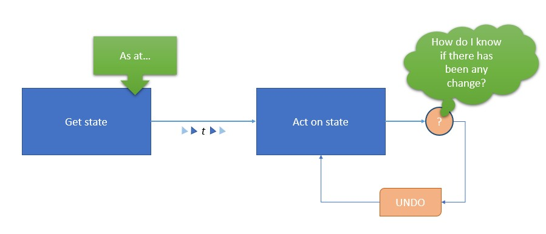
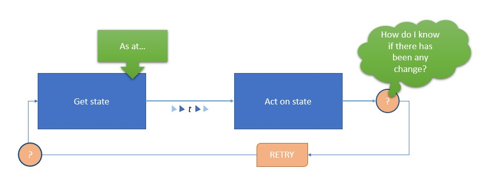

# Taming the Concurrency Crocodile

## What is the **problem**?

At its most basic a computer program can be broken down into two components: the firststep is to get the current state and then the second step is to perform some action based on that state.  The problem with this is that this takes a finite amount of time, which means there is a risk that the current state you are acting on may not be current any more.

It isn't really a defect as such but more an innevitable fact that we have to be aware of and take steps to mitigate.  I have called it a concurrency crocodile as a crocodile is an ambush predator that catches the unwary.

## Solution 1: **Transactions**

The traditional solution to the concurrency crocodile is to perform the get-then-set steps inside of a database transaction so that we are guaranteed to be working on the latest state.  In a transaction, _as viewed from the outside_, the whole thing either happens or does not happen.

Within a transaction you want to do as little work as you can, as they do become a performance bottle neck in a large or distributed system.  You also need to plan for what you are going to do if the transaction gets rolled back for any reason - if a _real world_ thing has happened and you have no record of it this may be as serious as a concurrency error.

_add why this "one-size fits all" doesn't work, how event sourcing is different to this_

## Solution 2: **Locks on crocs**

An alternative that is very closely related to transactions is to use writer locks to ensure that only one process is allowed to write to an event stream at any given point in time.  This guarantees that if you have acquired the lock then no other party can come along and change your state whilst you were processing based on it.

This solution does require some way of "unlocking" the event stream if an erroroccurs which leaves it in a locked state - this can be a manual process or a lock trimming process.

However both transactions and locks solve the concurrency problem by **change prevention** – which is not always something that your particular business can tolerate.  An alternative approach is to detect when a concurrency issue has occured and to repair the event stream so as to fix it.

## Solution 3: **Undo**, redo, undo etc.

In this alternative approach, you allow the arrowof time to continue and check as or after your change is to be committed whether the state could have changed while you were processing the command.

In order to know that the state has changed while you were processing it you would need to get the top sequence number of the event stream(s) that went into the projections which supplied you with the state you are acting on and to only commit the new event(s) for the command if the top sequence number has not changed.  Most event sourcing implementations provide this capability for just this use case.

## Solution 3b: **Re-run** on fault

A slightly easier way of achieving this is based on the **saga pattern** and consists of undoing and redoing the command in its entirety if any part of it has a concurrency crocodile issue detected.

This can work quite well if there are relatively few concurrency clashes and every part of a command has a compensation defined to undo it if the _rollback and retry_ is needed.

## Solution 4: Look **behind** you

In some circumstances it is possible to reframe the business rule such that it refers to some prior state.  For example you might have a rule like "interest on the accopunt is calculated according to the balance _as of midnight on the trading day_ ..." 

Since, in an event sourced system, prior state is immutable you can use that fact to run the process after the cut-off time but only project the state up to that cut-off time.  This eliminates the concurrency crocodile altogether.

## Wrapping it up

As is often the case there is no _one size fits all_ solution here - which one(s) you use and where is one of those *it depends* decisions.  

If your system is a line of business type of system that has operates synchronously and the user interface is interacting with humans then one of the two change prevention strategies will be easiest.  In practice this would nearly always mean relying on transactions provided by the underlying storage technology.  

The optimistic concurrency of an undo-redo-undo or saga process is a better option of asynchronous systems and anything connecting to wait intolerant systems.

Rewriting the business rule to work behind the current state is, of course, something that needs to be discussed with the business but there are many business domains that have operated in a distributed model that already cater for this way of operating.  

## Other possibilities

One possibility is to **do nothing** - If the cost of a concurrency issue is low it may be possible just to ignore the problem altogether 
